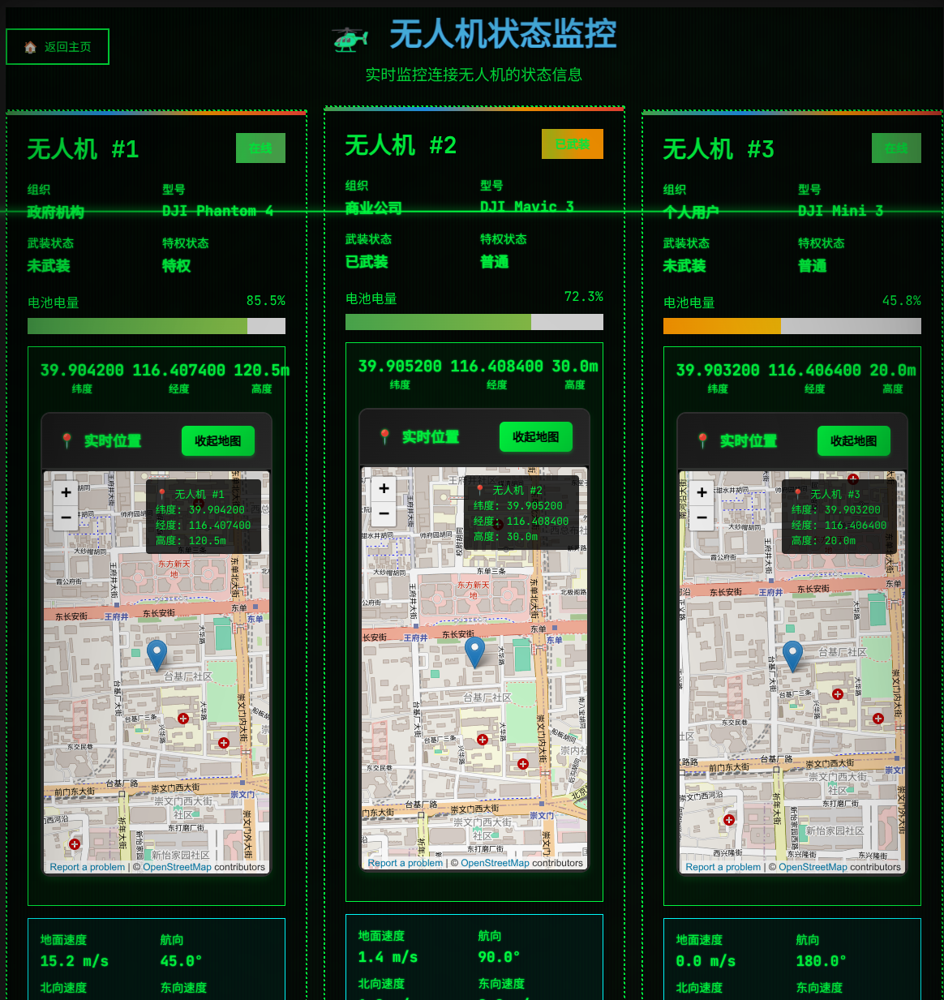
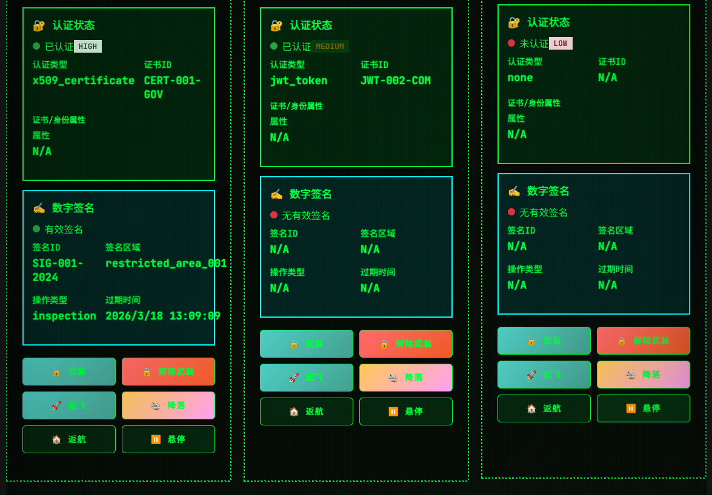
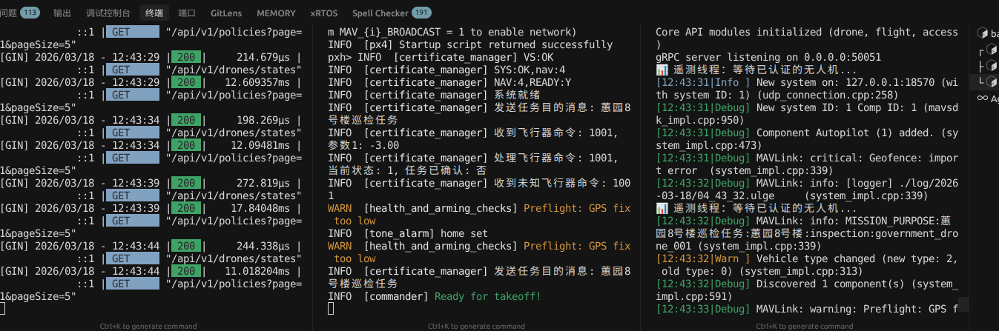
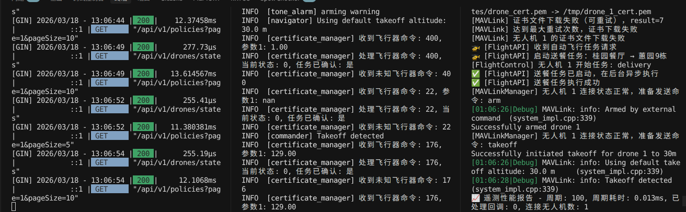
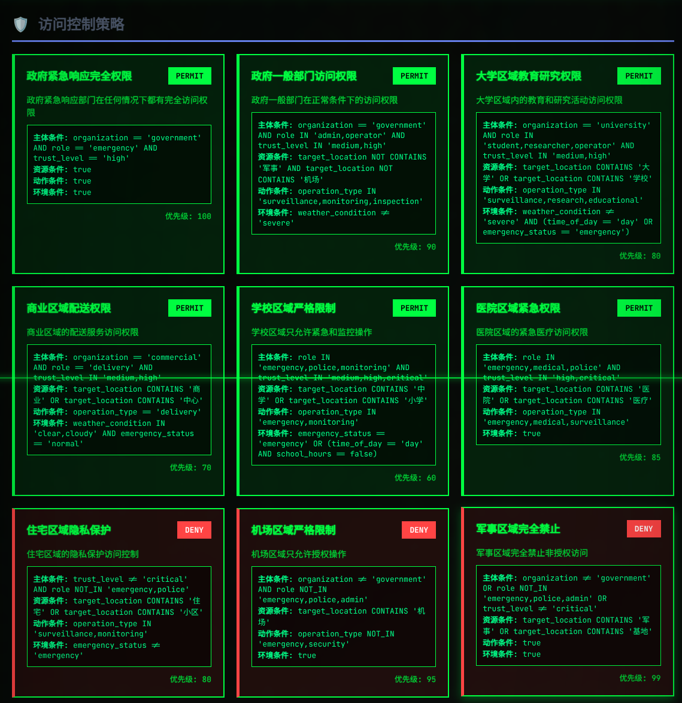
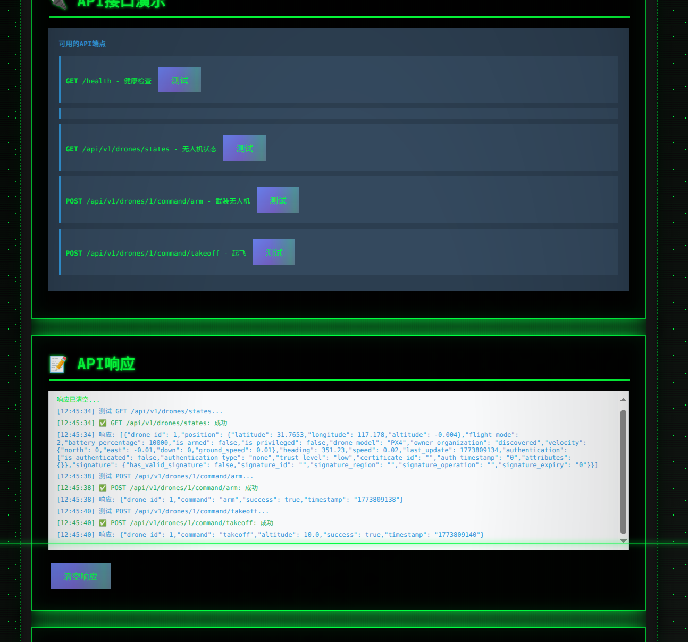
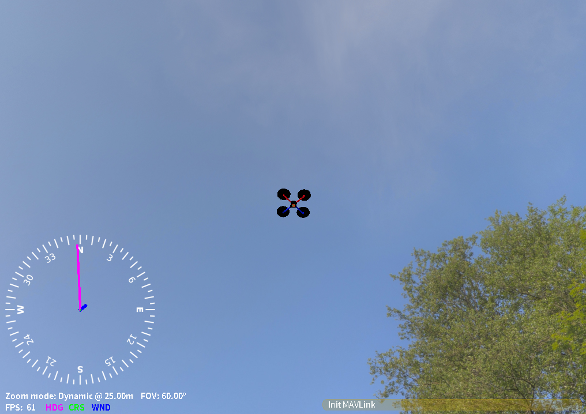
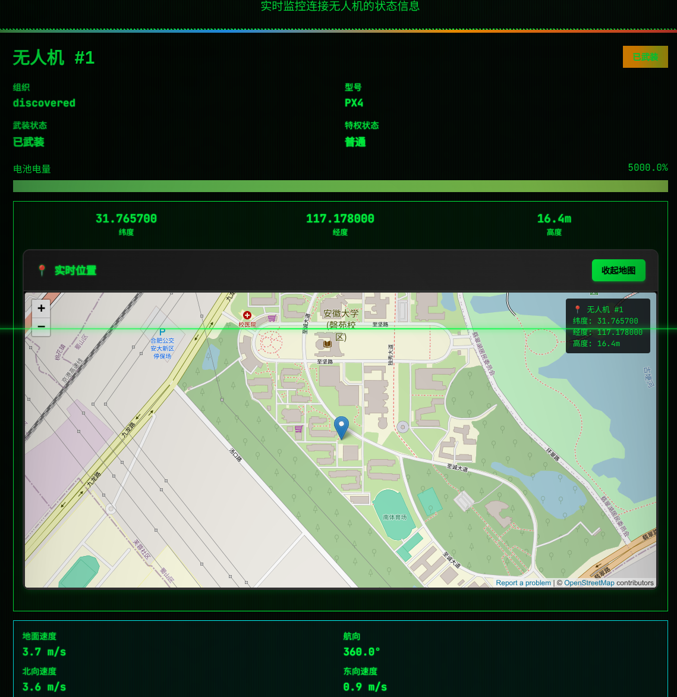

# 无人机访问控制系统

## 系统设计

基于属性的访问控制 (ABAC) 系统，支持**身份 → 区域 → 行为**三级控制，与 PX4/MAVLink 深度集成。

### 核心设计理念
- **隐私保护**：空域内隐私信息对无人机透明，地面端验证任务并生成飞行计划
- **多层控制**：三层访问控制模型确保全面安全
- **实时响应**：边缘设备与核心服务实时通信，快速评估访问权限
- **可扩展性**：模块化设计，易于集成新功能和设备

### 系统架构

#### 1. 核心服务（Core Service）
- **访问控制引擎**：实现 ABAC 策略评估，处理身份认证、区域访问和行为控制
- **MAVLink 管理器**：与无人机飞控直接通信，处理心跳、遥测和指令下发
- **gRPC 服务端**：提供对外接口，处理边缘设备和其他服务的请求
- **数据库交互**：与数据库服务通信，存储和获取配置、状态和决策信息

#### 2. 边缘设备服务（Edge Device Service）
- **边缘设备管理器**：与核心服务通信，处理注册、心跳、状态同步和权限评估
- **本地 MAVLink 通信**：与无人机飞控通信，获取状态并执行指令
- **测试模式**：支持模拟测试，验证系统功能

#### 3. 数据库服务（Database Service）
- **配置管理**：加载和存储配置文件，包括访问控制策略、空域配置等
- **状态存储**：保存边缘设备状态、无人机状态和访问决策
- **缓存管理**：使用 Redis 缓存热点数据，提高性能

### 访问控制流程

1. **身份认证**：验证无人机身份和证书
2. **区域访问控制**：评估无人机是否有权限进入特定区域
3. **行为控制**：评估无人机在区域内的行为是否合规
4. **决策生成**：根据评估结果生成访问决策和飞行计划
5. **指令执行**：向无人机发送授权指令或拒绝访问

### 技术实现

- **C++17**：核心服务和边缘设备服务的主要开发语言
- **gRPC**：服务间通信协议，提供高效的远程过程调用
- **MAVLink**：与 PX4 飞控的通信协议
- **nlohmann/json**：JSON 处理库，用于配置和数据交换
- **yaml-cpp**：YAML 配置文件解析
- **OpenSSL**：加密和安全功能
- **Miracl Core**：密码学库，用于地理围栏签名

### 配置管理

- **配置文件**：使用 YAML 格式存储系统配置
- **自动加载**：数据库服务启动时自动加载所有配置文件
- **持久化存储**：配置文件存储到数据库，确保系统重启后配置不丢失
- **热更新**：支持配置文件的动态更新

### 数据库设计

- **PostgreSQL**：存储持久化数据，如配置文件、边缘设备信息和访问决策
- **Redis**：缓存热点数据，如无人机状态和配置文件

## 项目目标

本项目旨在构建一个安全、高效、可扩展的无人机访问控制系统，通过多层访问控制确保空域安全，同时保护隐私信息。系统支持多无人机管理、实时状态监测和智能访问决策，为无人机运行提供全面的安全保障。

---

## 依赖

- CMake 3.16+
- C++17
- yaml-cpp, OpenSSL, nlohmann_json, GMP (libgmp-dev)
- MAVSDK（可选，用于 PX4/MAVLink）
- Miracl Core（需先构建）
- TBB / OpenMP / Boost.Asio（可选）

## 功能演示图


### 多无人机状态监测





### 高级任务上传


### 后台





### 访问控制策略展示



### API 接口测试



### 单无人机飞行仿真






## 构建

### 1. 构建 Miracl Core

```bash
./build_miracl_ed25519.sh
```

### 2. 构建项目

```bash
# 安装依赖
# Ubuntu: sudo apt install libgrpc++-dev protobuf-compiler-grpc libprotobuf-dev libyaml-cpp-dev libssl-dev libgmp-dev

# 构建项目
mkdir build && cd build
cmake ..
cmake --build .

# 构建特定目标
cmake --build . --target drone_grpc_server  # 核心服务
cmake --build . --target edge_device_app   # 边缘设备服务
cmake --build . --target database_service_app  # 数据库服务
```

## 运行系统

### 1. 启动数据库服务

```bash
./build/database_service_app
# 默认监听 0.0.0.0:50052
# 自动加载配置文件并存储到数据库
```

### 2. 启动核心服务

```bash
./build/drone_grpc_server [config.yaml]
# 默认监听 0.0.0.0:50051
# MAVLink 监听：udp://0.0.0.0:14550（自动发现无人机）
```

### 3. 启动边缘设备服务

```bash
# 正常模式
./build/edge_device_app

# 测试模式（模拟无人机访问控制）
./build/edge_device_app --test
```

### 4. 系统架构运行示例

```
┌─────────────────┐     gRPC     ┌─────────────────┐     gRPC     ┌─────────────────┐
│ 边缘设备服务     │────────────>│ 核心服务       │────────────>│ 数据库服务     │
│ Edge Device App │<────────────│ Core Service   │<────────────│ Database Service │
└─────────────────┘             └─────────────────┘             └─────────────────┘
        ↑                              ↑
        │ MAVLink                      │ MAVLink（小面积的空域，无须边缘设备）
        ↓                              ↓
┌─────────────────┐             ┌─────────────────┐
│ 无人机飞控       │             │ 无人机飞控       │
└─────────────────┘             └─────────────────┘
```

## 系统功能

### 核心服务功能
- **访问控制评估** ：执行访问控制判断，基于收集到的无人机信息和预设策略
- **策略执行** ：根据访问控制决策，生成对应的令牌和飞行计划
- **结果返回** ：将生成的令牌和飞行计划通过 gRPC 远程调用返回给边缘设备，而不是直接返回给无人机

### 边缘设备职责
- **与无人机通信** ：通过 MAVLink 协议与无人机飞控直接通信，获取无人机状态、目的和属性
- **信息收集** ：收集无人机的目的、证书和属性信息
- **远程调用**  ：将收集到的信息打包，通过 gRPC 远程调用访问控制核心的访问控制功能
- **中介作用** ：作为无人机和核心服务之间的桥梁，起到精细化区域控制的媒介作用
- **结果转发** ：接收核心服务返回的令牌和飞行计划，然后发送给无人机

### 数据库服务功能
- **配置管理**：加载和存储配置文件
- **状态存储**：保存边缘设备和无人机状态
- **配置存储**：存储访问控制策略、空域配置、认证配置等
- **决策存储**：记录访问控制决策

## gRPC 服务接口

#### 1. 核心服务接口
- `GetDrones`：获取所有无人机信息
- `GetDroneStates`：获取无人机状态
- `GetDroneDetail`：获取无人机详细信息
- `FlightCommand`：发送飞行指令
- `FlightCommandWithParams`：发送带参数的飞行指令
- `AutoFlightRequest`：自动飞行请求
- `GetFlightStatus`：获取飞行状态
- `EvaluateAccess`：评估访问权限
- `ConfirmMission`：确认任务

#### 2. 边缘设备服务接口
- `RegisterEdgeDevice`：注册边缘设备
- `SyncDroneState`：同步无人机状态
- `EvaluateEdgeAccess`：评估边缘设备访问权限
- `Heartbeat`：边缘设备心跳

#### 3. 数据库服务接口
- `SaveDroneState`：保存无人机状态
- `GetDroneState`：获取无人机状态
- `SaveEdgeDeviceInfo`：保存边缘设备信息
- `GetEdgeDeviceInfo`：获取边缘设备信息


## 配置

### 配置文件结构

- `config/` - 配置文件目录
  - `main_config.yaml` - 主配置文件，包含 MAVLink 连接、网络配置等
  - `access_control_policies.yaml` - 访问控制策略配置
  - `airspace_config.yaml` - 空域配置
  - `authentication_config.yaml` - 认证配置
  - `flight_paths.yaml` - 飞行路径配置
  - `certificates/` - 证书目录

### 配置文件加载

- 数据库服务启动时会自动加载所有配置文件
- 配置文件会存储到数据库中，确保系统重启后配置不丢失
- 支持配置文件的动态更新

## 目录说明

### 核心目录

- `proto/` - gRPC 服务与消息定义
- `src/` - 源代码目录
  - `grpc/` - gRPC 服务实现
  - `backend_init.cpp` - 后端初始化
  - `communication/` - 通信模块
  - `state/` - 状态管理
  - `access_control/` - 访问控制引擎
  - `signature/` - 签名服务
  - `flight_control/` - 飞行控制模块
  - `database/` - 数据库服务
  - `edge/` - 边缘设备服务
- `api-go/` - Go 网关（方便开发可视化界面）
- `tools/` - 工具脚本和测试程序
- `third_party/` - 第三方库

### 构建产物

- `build/` - 构建目录
  - `drone_grpc_server` - 核心服务可执行文件
  - `edge_device_app` - 边缘设备服务可执行文件
  - `database_service_app` - 数据库服务可执行文件


## 故障排查

### 常见问题

1. **数据库连接失败**：检查数据库服务是否启动，端口是否正确
2. **MAVLink 连接失败**：检查网络配置，确保无人机在同一局域网内
3. **访问控制评估失败**：检查访问控制策略配置，确保策略正确
4. **配置文件加载失败**：检查配置文件路径和格式是否正确

### 日志查看

- 核心服务日志：标准输出
- 边缘设备服务日志：标准输出
- 数据库服务日志：标准输出

## 未来规划

- **多区域支持**：扩展系统支持多个空域管理
- **实时监控**：添加实时监控和告警功能
- **机器学习**：集成机器学习算法，优化访问控制决策
- **区块链集成**：使用区块链技术增强系统安全性和可追溯性
- **云服务集成**：支持云端部署和管理


